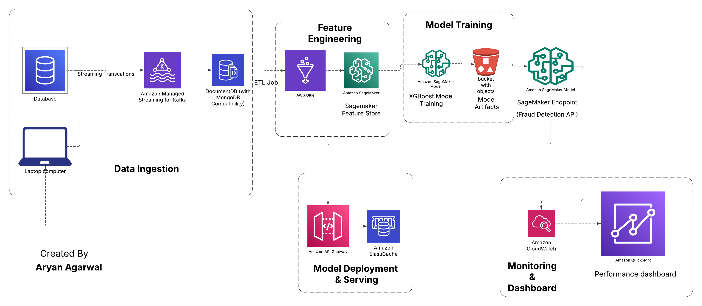

# 🚀 AWS SageMaker Fraud Detection System

## 📖 Overview  
This project was developed as part of my **Graduate Research Assistantship** at **California State University, Fullerton - College of Business**, in the **Information Systems and Decision Sciences (ISDS) Department**.  

It was a **client-based project**, meaning that the actual dataset used was different and confidential. However, for this implementation, I have used a **synthetic dataset** containing approximately **6 million transaction records**, which was expanded to **12 million rows using SMOTE** to address class imbalance issues in fraud detection.  

The project aims to build a **real-time fraud detection system** using AWS services and **XGBoost**, ensuring **scalability, low latency, and high accuracy**.  

---

## 🏗️ Architecture  
The system follows a **modular architecture** with five key stages:  

### **1️⃣ Data Ingestion**  
- Transactions are **streamed in real-time** via **Amazon MSK (Kafka)**.  
- Transactions are **stored in Amazon DocumentDB**, a **MongoDB-compatible NoSQL database**.  

### **2️⃣ Feature Engineering**  
- **AWS Glue** performs **ETL (Extract, Transform, Load) operations** on transaction data.  
- Features are stored in **Amazon SageMaker Feature Store**, enabling **efficient training & inference**.  

### **3️⃣ Model Training (XGBoost)**  
- **Amazon SageMaker Training Jobs** train an **XGBoost model** using the **synthetic dataset**.  
- The dataset consists of **12 million transactions**, balanced using **SMOTE** to generate additional fraud samples.  
- The trained model is **saved in Amazon S3** as a model artifact for future use.  

### **4️⃣ Model Deployment & Serving**  
- The trained model is deployed using **Amazon SageMaker Endpoint**, making it accessible via an API.  
- **Amazon API Gateway** provides a REST API for real-time fraud predictions.  
- **Amazon ElastiCache (Redis)** is used to **cache frequent fraud detection requests**, improving latency.  

### **5️⃣ Monitoring & Dashboard**  
- **Amazon CloudWatch** continuously monitors model performance and fraud detection accuracy.  
- **Amazon QuickSight** provides a **dashboard** to visualize fraud trends and system performance.  

### **📌 Architecture Diagram**  
  

---

## **🔬 XGBoost Model for Fraud Detection**
### **📌 Dataset Used**
- This project was originally built for a **client** at **CSUF ISDS Department**, where we used a **confidential dataset**.  
- For this open-source version, we used a **synthetic dataset** of **6 million transactions**, expanded to **12 million using SMOTE** to improve fraud detection accuracy.  

### **📌 Data Preprocessing**
- Removed unnecessary columns such as **user IDs**.  
- Created **error balance features** to capture discrepancies in account balances.  
- Applied **one-hot encoding** to convert categorical variables.  
- Used **SMOTE (Synthetic Minority Over-sampling Technique)** to handle class imbalance and increase fraudulent transaction samples.  

### **📌 Model Training & Evaluation**
- The dataset was split into **training and testing sets**.  
- **Feature scaling** was applied to normalize transaction amounts and account balances.  
- **XGBoost (Extreme Gradient Boosting)** was chosen for its **efficiency and ability to handle large imbalanced datasets**.  
- The model was evaluated using **Precision, Recall, F1-Score, and AUPRC (Area Under Precision-Recall Curve)**.  

### **📌 Model Performance**
| Metric  | Score  |
|---------|--------|
| **AUPRC (Precision-Recall Curve)** | **0.9993** |
| **Accuracy** | **99.99%** |
| **Precision** | **1.00** |
| **Recall** | **1.00** |
| **F1-Score** | **1.00** |

### **📌 Model Deployment**
- The trained XGBoost model was **saved and deployed on Amazon SageMaker Endpoint**.  
- An API was exposed via **Amazon API Gateway**, allowing external applications to make fraud detection requests.  
- **Amazon ElastiCache (Redis)** was used to **cache predictions** and improve response times.  

---

## **📦 Installation & Setup**
### **1️⃣ Clone the Repository**
- Clone this project from GitHub and navigate into the project directory.  

### **2️⃣ Set Up AWS Credentials**
- Configure AWS CLI with the necessary credentials for accessing AWS services.  

### **3️⃣ Install Dependencies**
- Install required libraries such as **Boto3, SageMaker SDK, Pandas, NumPy, and XGBoost**.  

### **4️⃣ Deploy the Model**
- Run the training script to **train and save the XGBoost model** on Amazon SageMaker.  

### **5️⃣ Start API Gateway & Model Endpoint**
- Deploy the trained model to **SageMaker Endpoint** and expose it via **API Gateway**.  

---

## **📌 Future Enhancements**
🔹 **Use Deep Learning Models** (LSTMs, Transformers) instead of XGBoost for better fraud detection.  
🔹 **Implement Automated Model Retraining** using fraud feedback loop.  
🔹 **Integrate Reinforcement Learning** for adaptive fraud detection.  

---

## **📌 Key AWS Services Used**
| **Component**           | **AWS Service Used**                |
|------------------------|------------------------------------|
| **Streaming**         | Amazon MSK (Kafka)                |
| **Database**         | Amazon DocumentDB (MongoDB)       |
| **Feature Engineering** | AWS Glue                         |
| **Feature Store**    | Amazon SageMaker Feature Store    |
| **Model Training**   | Amazon SageMaker (XGBoost)       |
| **Model Deployment** | Amazon SageMaker Endpoint         |
| **API**              | Amazon API Gateway               |
| **Caching**         | Amazon ElastiCache (Redis)       |
| **Monitoring**      | Amazon CloudWatch                |
| **Dashboard**       | Amazon QuickSight                |

---

## **🔗 References**
- [Amazon SageMaker Docs](https://aws.amazon.com/sagemaker/)  
- [AWS Glue Docs](https://aws.amazon.com/glue/)  
- [AWS ElastiCache (Redis)](https://aws.amazon.com/elasticache/)  
- [Amazon QuickSight](https://aws.amazon.com/quicksight/)  
- [XGBoost Documentation](https://xgboost.readthedocs.io/)  

---

## **🛡 Security & Compliance**
- **AWS IAM** manages access control for all services.  
- **AWS KMS** encrypts sensitive transaction data.  
- **GDPR & PCI-DSS compliance** ensured for fraud detection.  

---

## **📜 License**
This project is licensed under **MIT License**.

---
### **👨‍💻 Author**
Created by **Aryan Agarwal**  
🚀 **Feel free to contribute or raise issues!**  

---
